# raft-kv — Design

A small, runnable distributed key-value store built on the Raft consensus
algorithm. The consensus core — Raft engine, WAL, snapshots, KV state machine,
RPC transport, metrics registry — is hand-rolled in Go on the standard library
with zero third-party dependencies; the only external code is the
OpenTelemetry SDK for trace export at the server edge (ADR-007). This document
explains what it is, what it deliberately is not, how it fails, and the
trade-offs that shaped it.

For the rationale behind specific decisions, see the ADRs in
[decisions/](decisions/). For the gaps an attacker would exploit, see the
[threat model](threat-model.md).

## Problem

A learning project that goes far enough to be *real*: not "Raft in tests" but
a cluster you can launch, write to, kill a node of, and watch recover. Concretely:

- A 3-node cluster that elects a leader and replicates writes.
- A simple text protocol so a human can drive it with `nc`.
- A WAL + snapshots, so state survives restart and the log doesn't grow forever.
- Dynamic membership so the cluster can grow or shrink without downtime.
- Linearizable reads (not stale-from-any-follower).

## Goals

- **Correctness of the consensus protocol** under the failures Raft covers:
  leader crash, follower crash, network partition, slow follower.
- **Recoverable persistence**: WAL replay + snapshot install bring a node back
  to the latest committed state.
- **Demonstrable end-to-end**: `scripts/cluster-up.sh` boots a working 3-node
  cluster; `kill -9` the leader and writes still succeed.
- **Defensible design choices** with named, rejected alternatives (see ADRs).

## Non-goals

The point of being explicit about these is that "we didn't build X" is a
deliberate choice, not a missing feature.

- **Multi-region / geo-replication.** Single LAN, low-latency RPC assumed.
- **Multi-key transactions.** State machine is a flat key→value map; each
  command is independent.
- **SQL or secondary indexes.** Get/Put/Delete only.
- **Encryption or authentication of any kind.** Peer RPC is plaintext JSON
  over TCP and unauthenticated. See [threat model](threat-model.md).
- **Joint-consensus membership changes.** Single-server-at-a-time only
  (ADR-001).
- **High-throughput optimisations.** No batching, no pipelining of
  `AppendEntries`, no flush-coalescing of the WAL. The implementation is
  deliberately one-RPC-per-entry-per-peer until a benchmark proves something
  needs to change.
- **Production-grade operability.** No metrics, no structured logs, no health
  endpoints — these are out of scope here.

## Architecture



Concretely:

- `cmd/server/main.go` parses flags and either starts the legacy single-node
  `Server` (no flags, listens on `:8080`) or the cluster-mode `RaftServer`.
- [internal/server/raft_server.go](../internal/server/raft_server.go) speaks
  the line protocol to clients and routes writes through `AppendCommand`,
  reads through `ReadIndex`, and membership through `AddServer`/`RemoveServer`.
- [internal/raft/raft.go](../internal/raft/raft.go) implements the protocol.
  Peer RPCs are dispatched by a string switch on `RPCMessage.Type` (one of
  `RequestVote` / `AppendEntries` / `InstallSnapshot`).
- [internal/log/log.go](../internal/log/log.go) is the WAL: length-prefixed
  binary records, replayed on startup.
- [internal/kv/store.go](../internal/kv/store.go) is the state machine, with
  client-request dedup keyed on `(ClientId, RequestId)`.

## Consistency

Under partition, the design favours **consistency over availability** (CP):

- Writes go through the leader and only commit when a majority acknowledges.
  A minority partition cannot make progress.
- Reads use the [ReadIndex](decisions/ADR-002-readindex-vs-leases.md)
  path: the leader sends a fresh heartbeat round to confirm it is still
  leader before serving the read. A partitioned leader whose heartbeats no
  longer reach a majority returns an error rather than stale data —
  verified at [internal/raft/raft.go:1175-1214](../internal/raft/raft.go#L1175-L1214).
- **Read-from-follower is not supported.** It would be faster but stale.

## Failure modes

| Failure | Detection | Recovery | Client impact |
|---|---|---|---|
| Leader crash | Heartbeats stop reaching followers; election timer fires | Followers elect a new leader within one randomised election timeout (150-300 ms) | Brief write unavailability; client retries against a new node when it sees `NOT_LEADER` |
| Follower crash | Leader's `AppendEntries` to that peer fail | None required for liveness (majority still works); follower catches up via log replication or `InstallSnapshot` on restart | None — writes still commit if majority is alive |
| Network partition | Heartbeats fail; `ReadIndex` cannot confirm leadership | Majority side keeps committing; minority side rejects reads and cannot commit writes | Minority-side clients see errors; majority-side clients keep working |
| Slow follower | Leader's `nextIndex[peer]` lags | Leader keeps retrying `AppendEntries`; falls back to `InstallSnapshot` if the follower is behind the snapshot boundary | None — does not block commit |
| Disk corruption (WAL / state / snapshot) | `NewRaft` fails to parse on startup | **Process panics.** Operator must restore from another node. See [ADR-004](decisions/ADR-004-panic-on-corrupt-file.md). | Node down until manual recovery |
| Process kill during write | WAL flush may be partial | Replay drops the trailing partial record; uncommitted entries are re-replicated by the next leader | At-least-once retry semantics for the client (see below) |

## Deployment (Kubernetes)

The cluster ships as a container image (multi-stage build → `distroless/static`,
non-root uid 65532, ~10 MB; see [Dockerfile](../Dockerfile)) and runs on
Kubernetes as a **StatefulSet, not a Deployment**. A consensus group needs two
things a Deployment cannot give:

- **Stable identity.** Each member must keep the same name and DNS record across
  reschedules, because peers address each other by name. StatefulSet pod
  `raft-kv-0` is always `raft-kv-0`, resolvable at `raft-kv-0.raft-kv` through a
  headless `Service`; a Deployment hands out random pod names.
- **Stable per-member storage.** Each member owns its WAL + snapshots. A
  StatefulSet binds pod `raft-kv-N` to its own `PersistentVolumeClaim`
  (`data-raft-kv-N`) and reattaches the *same* volume after a reschedule, so the
  pod rejoins with its history rather than as a blank node. A Deployment shares
  no stable per-pod volume.

**Peer discovery.** A StatefulSet uses one pod template, so every pod gets the
same command line — yet each Raft node's peer list must exclude itself (quorum is
sized `len(peers)+1`). Rather than generate a per-pod list (the distroless image
has no shell to do so at startup), every pod is handed the *same* `--peers`
spanning the whole cluster plus `--id=$(POD_NAME)` from the downward API, and the
binary drops its own entry ([cmd/server/main.go](../cmd/server/main.go),
`parsePeers`). This is fixed-size static membership over predictable DNS names.

Two consensus-specific gotchas the [chart](../deploy/helm/raft-kv/) handles:
the headless Service sets `publishNotReadyAddresses: true` so peers can resolve
each other to hold the *first* election (which happens before any pod is Ready),
and `podManagementPolicy: Parallel` starts the members together instead of
blocking on a lone `raft-kv-0` that cannot reach quorum by itself.
`scripts/k8s-up.sh` stands the whole thing up on kind.

Validated end-to-end: deleting the leader pod elects a new leader within one
election timeout and the rescheduled pod rejoins from its PVC with no data loss.

## Supply chain & GitOps

The image and its delivery are part of the design, not an afterthought. The CI
pipeline (`.github/workflows/`) gates and provenances every release:

- **Quality gates** on every PR and push: `gofmt` + `go vet` + `go test -race`
  ([go.yml](../.github/workflows/go.yml)); `helm lint` + kubeconform render at
  N=1/3/5 ([helm.yml](../.github/workflows/helm.yml)); a Trivy `HIGH,CRITICAL`
  fixable-CVE gate ([trivy.yml](../.github/workflows/trivy.yml)); and full-history
  secret scanning with gitleaks ([gitleaks.yml](../.github/workflows/gitleaks.yml)).
- **Build + provenance** ([image.yml](../.github/workflows/image.yml)): the distroless
  image is published to GHCR and, by digest, **cosign keyless-signed** (GitHub OIDC →
  Fulcio → Rekor; no private keys) and attested with **SLSA build provenance** and an
  **SPDX SBOM**. Verification commands are in the
  [README](../README.md#verifying-the-published-image).
- **Delivery**: an Argo CD `Application` reconciles the
  [Helm chart](../deploy/helm/raft-kv) into the cluster — pull-based GitOps with
  auto-sync, prune, and selfHeal. Monorepo layout and its trade-offs:
  [ADR-005](decisions/ADR-005-monorepo-vs-config-repo.md).
- **Admission enforcement**: a sigstore policy-controller
  [ClusterImagePolicy](../deploy/policy/raft-kv-image-policy.yaml) refuses, in opted-in
  namespaces, to run an image not signed by this repo's `image.yml` identity — the
  in-cluster half of "we sign our images." Because admission controllers can't yet verify
  cosign's bundle-format signatures, `image.yml` dual-signs (bundle + legacy) and the policy
  verifies the legacy signature. Engine choice and that limitation:
  [ADR-006](decisions/ADR-006-policy-controller-vs-kyverno.md).

This closes the loop from source to running pod: a change is tested, the image is built,
scanned, signed, and provenanced; Argo rolls it out declaratively; and admission control
checks the signature before the kubelet runs it.

## Observability

The interesting failure modes of a consensus system are invisible from the outside —
a stale leader, a widening committed/applied gap, an election storm all look like
"slow" until the internals are telemetry. M6 instruments them across three signals,
joined by a per-request trace ID:

- **Metrics** (zero-dep, hand-rolled): `internal/metrics/` implements the Prometheus
  text exposition format directly — gauges, counters, histograms with explicit
  buckets — served over stdlib `net/http` on `--metrics-addr` with `/healthz` and
  `/readyz` (ready = joined cluster, applied caught up to commit). Raft state is set
  inline at its mutation points (already under `r.mu`, so lock-safe): term, leadership,
  elections and their duration, commit **and** applied index (the committed≠applied
  lesson as a gauge pair), log length, snapshot floor, and append→commit latency.
  The client API gets RED metrics by op and result class.
- **Logs**: stdlib `log/slog`, JSON to stdout, shipped by Promtail to Loki in the
  cluster deploy. The events the system used to be silent about — election start/win,
  step-downs (with reason), snapshot install, membership changes, and `callRPC`
  transport errors that were flattened to `bool` — are all structured events now.
- **Traces**: OpenTelemetry spans at the server layer only —
  `raftkv.request` → `raft.append` → `raft.replicate_commit_apply` (writes) or
  `raft.read_index` → `raft.apply_wait` (reads) — exported OTLP directly to Tempo when
  `--otlp-endpoint` is set. The consensus core (`internal/raft`, `internal/log`,
  `internal/kv`, `internal/metrics`) imports no third-party code; the OTel SDK at the
  edge is the project's only dependency. Why that line was drawn there:
  [ADR-007](decisions/ADR-007-otel-vs-zero-dep-tracing.md).

The stack (kube-prometheus-stack, Loki, Promtail, Tempo) is a separate Argo CD
Application ([deploy/observability](../deploy/observability)) so observability churn
stays out of the app's deploy history; dashboards (Raft internals, RED, SLO burn rate)
are committed JSON, loaded by Grafana's sidecar. `scripts/observability-demo.sh`
reproduces the correlation demo: leader killed under load, one incident visible in
every signal.

## Reliability

Kubernetes can break quorum as easily as a Raft bug if resource or scaling policy
is wrong. The Helm chart therefore treats voters as a consensus group, not a
stateless Deployment (see `deploy/helm/raft-kv/values.yaml`):

- **CPU request, no CPU limit.** Election and heartbeat paths are latency-sensitive;
  CFS throttling under a limit looks like a slow peer and can amplify elections.
- **Memory request == limit (Guaranteed on the OOM dimension).** OOM kills bypass
  PodDisruptionBudgets; during a rolling update an OOM on a second pod is a quorum
  loss. Snapshot construction marshals the full KV state, so the limit must leave
  headroom.
- **`GOMEMLIMIT` ≈ 90% of the memory limit.** Soft-caps the Go heap so GC prefers
  collecting over growing into a kubelet OOMKill.
- **PDB `maxUnavailable: 1`.** Caps **voluntary** disruptions (`kubectl drain`,
  eviction API) so maintenance cannot take the cluster below quorum. Prefer
  `maxUnavailable` over `minAvailable: 2` (the latter silently allows too many
  evictions at `replicaCount=5`). Helm fails if the knob would break quorum
  (`maxUnavailable ≥ ceil(N/2)`).
- **No HPA.** More voters ≠ more write throughput — every write still needs a
  majority. Membership changes are deliberate single-server Raft config changes,
  not Deployment replica bumps; an autoscaler scale-down can destroy quorum.
  Read scale-out would need non-voting learners, which this implementation does
  not have (future work).

### What the PDB does not cover

Never claim “PDB prevents quorum loss.” It only bounds **voluntary** multi-pod
disruption. These bypass it:

| Event | Guard instead |
|-------|----------------|
| OOM kill | Memory request==limit + `GOMEMLIMIT` |
| Node crash / power loss | Replication + PVC rejoin |
| Liveness restart | Dumb `/healthz` (never leadership / `Ready()`) |
| `kubectl delete pod` | Operator discipline; not the eviction API |
| StatefulSet rolling update | **Ready gate** (`/readyz`), not the PDB — updates do not go through eviction |

### Binary upgrades (one-pod canary)

The chart sets `updateStrategy.type: RollingUpdate` explicitly
(`deploy/helm/raft-kv/values.yaml`). With `partition: 0` (default), Kubernetes
updates pods one at a time in reverse ordinal order and waits for each to become
Ready — that Ready gate is the real safety rail, not the PDB.

For a manual canary on a 3-voter cluster:

```bash
# 1) Only raft-kv-2 may take the new image
helm upgrade raft-kv ./deploy/helm/raft-kv \
  --set image.tag=<new> --set updateStrategy.rollingUpdate.partition=2
# watch: kubectl get pods -l app=raft-kv -w
# 2) Then raft-kv-1, then everyone
helm upgrade raft-kv ./deploy/helm/raft-kv --reuse-values \
  --set updateStrategy.rollingUpdate.partition=1
helm upgrade raft-kv ./deploy/helm/raft-kv --reuse-values \
  --set updateStrategy.rollingUpdate.partition=0
```

**Argo Rollouts:** parked. It does not natively manage StatefulSets; adopting it
would be workload-type surgery, out of M7 scope.

Probe mapping (`/healthz` vs `/readyz`), PDB honesty, and resource policy —
including rejected alternatives — are in
[ADR-008](decisions/ADR-008-quorum-aware-reliability.md).
Operator backup/restore (quiesced follower, wipe vs disaster, measured MTTR):
[runbooks/restore.md](runbooks/restore.md).

## Known correctness gaps

These are real and deliberate. Listed here so reviewers don't have to find them by reading the code.

- **At-least-once writes across failover.** The text protocol carries no
  `ClientId`/`RequestId`, so `KVStore` dedup
  ([internal/kv/store.go:42](../internal/kv/store.go#L42)) never triggers.
  A client that retries a `PUT` after a leader change can apply the write
  twice. Promoting the protocol to carry both IDs is parked for later and
  will be done if measurement work needs deterministic per-client throughput.
- **Peer RPC is unauthenticated and plaintext** — any host that can reach
  the raft port can pose as a peer. See [threat model](threat-model.md);
  fix planned in M8.
- **Two server paths exist** — the legacy single-node `Server` is still
  wired into the no-flag default and three existing tests. Consolidating
  is parked for later.
- **The StatefulSet cannot safely reconfigure Raft membership.** The chart sizes
  the cluster from `replicaCount` and regenerates the static `--peers` list from it,
  so scaling via Helm/Argo rolling-restarts every pod with a new peer set rather than
  adding a voter through joint-consensus `AddServer`. Declarative *deploys* are safe;
  declarative *membership change* is not — driving Raft membership from a StatefulSet is
  an open limitation flagged in
  [ADR-005](decisions/ADR-005-monorepo-vs-config-repo.md) and tracked as future work.

## Trade-offs (full rationale in ADRs)

| Choice | We picked | We rejected | Why |
|---|---|---|---|
| Membership change | Single-server-at-a-time | Joint consensus | [ADR-001](decisions/ADR-001-single-server-membership.md) |
| Linearizable reads | ReadIndex (heartbeat round) | Leader leases (clock-bound) | [ADR-002](decisions/ADR-002-readindex-vs-leases.md) |
| Peer transport | Hand-rolled JSON-over-TCP | gRPC | [ADR-003](decisions/ADR-003-json-tcp-vs-grpc.md) |
| Corrupt persistent file on boot | Panic | Return error and continue | [ADR-004](decisions/ADR-004-panic-on-corrupt-file.md) |
| Peer mTLS identity | Vault PKI + per-ordinal DNS SANs (ESO delivery) | Shared/wildcard cluster cert | [ADR-009](decisions/ADR-009-mtls-peer-identity.md) |
| Peer mTLS rollout | Fail closed when mounts missing; plaintext only if TLS unset | Silent TLS→plaintext fallback | [ADR-010](decisions/ADR-010-mtls-rollout.md) |

## What I learned (cross-reference)

The seven lessons in [README.md "What I learned"](../README.md#what-i-learned-building-this)
— randomised timeouts, committed≠applied, dedup state in snapshots, index
math after compaction, config-changes-on-log-not-commit, single-server
membership, ReadIndex must confirm leadership — are the *implementation*
view of the same trade-offs surfaced here. This document is the *design*
view; that section is the *experience report*.
