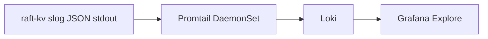

# Runbook — App security audit events in Loki

Operator guide for **Phase E #20**: querying app security audit events shipped
through the existing observability pipeline. Event schema and emit boundaries are
fixed in [ADR-012](../decisions/ADR-012-security-audit-events.md); emit code is
Phase E #19. Live verification is Phase E #21 (`verify-audit.sh`).

This is **network-source audit** (`remote` = client/peer `host:port`,
`actor=unauthenticated`). It is not user attribution and does not close T2/T9.

---

## What this is (and is not)

| In scope | Out of scope |
|----------|--------------|
| App `security_audit` JSON lines from raft-kv stdout | Kubernetes API-server audit logs |
| Query via Loki / Grafana Explore | Compliance-grade WORM retention |
| Filter `audit="true"` away from operational Raft noise | Logging keys, values, or cert PEMs |
| Correlate audit lines with Tempo via `trace_id` when present | Proving *who* ran a command (no client auth) |

**Do not claim** that installing Promtail + Loki gives you Kubernetes control-plane
audit. API-server audit is configured on the cluster (or managed-service equivalent)
independently; a different source, RBAC model, and retention policy apply.

---

## Delivery path

Audit lines use the **same pipe** as M6 operational logs — no second sink:



| Component | Where | Notes |
|-----------|-------|-------|
| Emitter | `internal/server/audit.go`, `internal/raft/audit.go` | `msg=security_audit`, `audit=true` |
| Collector | Promtail (`deploy/observability`) | Tails every pod's stdout on the node |
| Store | Loki `loki:3100` | Single-binary, filesystem PVC (~2Gi lab chart) |
| UI | Grafana datasource `uid: loki` | Derived `trace_id` field links to Tempo |

Promtail labels streams with **Kubernetes metadata** (`namespace`, `pod`,
`container`). The `audit=true` marker lives **inside** the JSON line — filter with
`| json` after the stream selector, not as a Loki label (no chart change required
at demo scale).

---

## Prerequisites

- Observability stack deployed (`deploy/observability` Argo app or
  `helm upgrade --install observability deploy/observability -n observability`)
- raft-kv pods running and writing JSON logs to stdout (cluster mode with `--id`)
- Grafana reachable (port-forward or NodePort — see below)

---

## Access Loki (Grafana Explore)

```bash
kubectl -n observability port-forward svc/grafana 3000:80
```

Open **Explore → Loki**. Default stream selector for a `default` namespace release:

```logql
{namespace="default", pod=~"raft-kv-.*"}
```

Adjust `namespace` if the Helm release lives elsewhere (`RAFT_NS` in demo scripts).

NodePort (kind with `deploy/kind-config.yaml`): Grafana on host `:3000`.

---

## LogQL cookbook

Set the time range to **Last 15 minutes** (or since your test action). All queries
below assume JSON `slog` output and append `| json` before field filters.

### All security audit lines

```logql
{namespace="default", pod=~"raft-kv-.*"} | json | audit="true"
```

Equivalent event-name filter:

```logql
{namespace="default", pod=~"raft-kv-.*"} | json | event=~"audit\\..+"
```

### By event type

**Client mutations** (`PUT` / `DELETE` attempts):

```logql
{namespace="default", pod=~"raft-kv-.*"} | json | event="audit.client.mutate"
```

**Membership changes** (`ADD_SERVER` / `REMOVE_SERVER`):

```logql
{namespace="default", pod=~"raft-kv-.*"} | json | event="audit.client.membership"
```

**Peer TLS authentication failures**:

```logql
{namespace="default", pod=~"raft-kv-.*"} | json | event="audit.peer.tls_fail"
```

### By outcome

```logql
{namespace="default", pod=~"raft-kv-.*"} | json | audit="true" | outcome="allow"
{namespace="default", pod=~"raft-kv-.*"} | json | audit="true" | outcome="deny"
{namespace="default", pod=~"raft-kv-.*"} | json | audit="true" | outcome="error"
```

| `outcome` | Typical client case | Typical peer TLS case |
|-----------|---------------------|------------------------|
| `allow` | Leader accepted `PUT`/`DELETE` (or `NOT_FOUND` on delete) | — |
| `deny` | `NOT_LEADER` redirect | Handshake or SAN↔id mismatch |
| `error` | Bad syntax, timeout, unknown verb | — |

### Operational logs only (exclude audit)

```logql
{namespace="default", pod=~"raft-kv-.*"} | json | audit != "true"
```

Useful when debugging elections/RPC noise without audit lines mixed in:

```logql
{namespace="default", pod=~"raft-kv-.*"} | json | audit != "true" | msg =~ "election_won|rpc_failed|request_started"
```

### Per-node view

```logql
{namespace="default", pod="raft-kv-1"} | json | audit="true"
```

### CLI (logcli)

If `logcli` is installed and port-forwarding Loki:

```bash
kubectl -n observability port-forward svc/loki 3100:3100 &
logcli query '{namespace="default", pod=~"raft-kv-.*"} | json | audit="true"' --limit=20
```

---

## Audit line schema (reference)

Every `security_audit` line includes:

| Field | Meaning |
|-------|---------|
| `audit` | Always `true` |
| `event` | `audit.client.mutate`, `audit.client.membership`, or `audit.peer.tls_fail` |
| `outcome` | `allow`, `deny`, or `error` |
| `node` | Raft pod / node id |
| `term` | Raft term when known (omitted if 0) |
| `remote` | Client or peer `host:port` only |
| `actor` | Always `unauthenticated` on client events |
| `action` | `PUT`, `DELETE`, `ADD_SERVER`, `REMOVE_SERVER`, `handshake`, or `identity` |
| `request_id` | Optional — only if the command carries JSON `requestId` |
| `trace_id` | Optional — same key as M6 request correlation |

**Never present:** key names, values, certificate PEMs, tokens.

Example (client mutation, leader accepted):

```json
{
  "time": "2026-07-13T16:00:00.123Z",
  "level": "INFO",
  "msg": "security_audit",
  "audit": true,
  "event": "audit.client.mutate",
  "outcome": "allow",
  "node": "raft-kv-1",
  "term": 7,
  "remote": "10.244.2.3:55123",
  "actor": "unauthenticated",
  "action": "PUT",
  "trace_id": "7f3a9c2e1b4d5068"
}
```

---

## Correlate audit with traces

Client audit lines may carry `trace_id`. Grafana's Loki datasource already defines
a derived field (regex on `"trace_id":"…"`) that links to Tempo — same as M6
operational request logs. Click the link on an `audit.client.mutate` line to see
the `raftkv.request` span for that attempt.

Peer TLS audit lines usually have no client `trace_id`; correlate by `remote`,
`node`, and timestamp.

---

## Retention

Lab observability chart settings ([`deploy/observability/values.yaml`](../../deploy/observability/values.yaml)):

- Prometheus retention: **24h**
- Loki: filesystem-backed single binary, **2Gi** PVC — suitable for demos, not
  long-term evidence storage

Treat Loki audit rows as **lab retention**, not an immutable audit vault. Extending
retention or adding object-store backends is out of M8 scope.

---

## What is not observable in Loki

| Event | Why |
|-------|-----|
| NetworkPolicy deny (packet never reaches the pod) | Process never sees the connection — no app log |
| Kubernetes API calls (`kubectl`, controllers) | API-server audit is a separate pipeline |
| Reads (`GET`) | Not in the ADR-012 audit event set |

Phase E #21 documents verification for the cases that *are* observable.

---

## Verify (Phase E #21)

```bash
./scripts/verify-audit.sh --namespace default
```

Requires raft-kv (3/3 Ready) **built with Phase E audit emit code**, observability
(Loki in `observability`), and a labeled client namespace. Peer TLS and NetworkPolicy cases are exercised when
the cluster has `tls.enabled=true` and an enforcing CNI (Calico/Cilium).

The script checks:

1. **Allow:** labeled client `PUT` on leader → `audit.client.mutate` `outcome=allow`
   in Loki; key/value strings absent from log lines
2. **Deny (client):** `PUT` to follower → `audit.client.mutate` `outcome=deny`
3. **Deny (peer TLS):** plaintext probe to `:9090` → `audit.peer.tls_fail`
   `action=handshake` (skipped when peer mTLS is off)
4. **NP not observable:** unlabeled pod blocked on `:8080` → no new client mutate
   audit in Loki (skipped when no enforcing CNI)

### Example output

```
==> preflight: cluster, raft-kv, and Loki
OK: Loki reachable
OK: labeled client pod ready
==> case 1: allowed client PUT (leader)
OK: leader raft-kv-1 accepted PUT
OK: Loki: audit.client.mutate outcome=allow (no key/value leak)
==> case 2: denied client PUT (follower)
OK: Loki: audit.client.mutate outcome=deny
==> case 3: peer TLS handshake failure (when mTLS enabled)
OK: Loki: audit.peer.tls_fail action=handshake on raft-kv-0
==> case 4: NetworkPolicy deny not observable from Loki
OK: NP-blocked connect produced no client mutate audit (not observable from Loki)

OK: audit verification complete
```

Run on your kind cluster after `./scripts/k8s-up.sh` and observability sync to
record a verified date here.

---

## Quick manual smoke

After a labeled client `PUT` (see [networkpolicy.md](networkpolicy.md)):

1. Grafana → Explore → Loki
2. Run `{namespace="default", pod=~"raft-kv-.*"} | json | audit="true"`
3. Confirm a recent `audit.client.mutate` line with `action=PUT` and no key/value
   fields in the JSON

For automated checks, use [Verify (Phase E #21)](#verify-phase-e-21) above.

---

## Kubernetes API audit (optional, separate)

If a lab needs control-plane audit (who called the Kubernetes API):

1. Enable API-server audit logging on the cluster (kind: audit policy + apiserver
   flags; managed clouds: platform logging product).
2. Ship those logs to a restricted store — **not** via Promtail scraping raft-kv
   pod stdout.
3. Document who can read API audit logs and their retention independently.

None of the above is required to complete M8 app-audit work.

---

## Related

- [ADR-012](../decisions/ADR-012-security-audit-events.md) — event contract
- [threat-model.md](../threat-model.md) — T5 repudiation status
- [observability-demo.sh](../../scripts/observability-demo.sh) — M6 correlation demo (metrics ↔ logs ↔ traces)
- [networkpolicy.md](networkpolicy.md) — authorized client namespace for `PUT`
