# raft-kv — Threat model (STRIDE-lite)

This is a learning prototype, not a production system. The threats below
are real — listed so reviewers don't have to find them by reading the
code, and so remaining M8 work (NetworkPolicy, audit, Vault/ESO) has a
clear scope.

## Scope

In scope:

- A 3-node cluster on a single LAN (kind / k3d / docker compose / bare
  hosts). With peer mTLS configured, the network is **not** trusted for
  Raft RPC authenticity or confidentiality; without TLS config (local
  demos / tests), peer RPC is still plaintext.
- Clients connecting to the line protocol on the node's client port.
- Peer-to-peer RPC on the node's raft port.

Out of scope:

- Multi-tenant operation.
- Full certificate lifecycle automation (Vault/ESO delivery is Phase B;
  dual-trust CA rotation is not claimed until drilled — see residuals).
- Confidentiality of data at rest (the WAL and snapshot files are
  plaintext on disk).
- Client-port TLS / authentication (T2, T9).

## Assets

| Asset | Where | Why it matters |
|---|---|---|
| Committed key-value state | WAL + snapshot on each node's data dir | The thing clients write and read |
| Raft term / vote state | `<data>/raft.state` | Tampering risks safety: an attacker could "vote" as us in a past term and change the outcome of an election |
| Leader identity at time T | In-memory, advertised via `NOT_LEADER <addr>` responses | A malicious leader can reject reads or commit malicious writes |
| Peer TLS private keys + CA | Mounted files / Secrets (when mTLS enabled) | CA or leaf compromise lets an attacker impersonate a voter |

## Trust boundaries

Anything that crosses an arrow is hostile. Anything inside the box is
trusted code we wrote. Peer RPC is authenticated only when mTLS is
configured ([ADR-009](decisions/ADR-009-mtls-peer-identity.md),
[ADR-010](decisions/ADR-010-mtls-rollout.md)).

## Threats (STRIDE-lite)

| # | STRIDE | Threat | Vector | Status |
|---|---|---|---|---|
| T1 | **S**poofing | A host that can reach the raft port can pose as a peer | Without TLS: plaintext RPC at [internal/raft/raft.go](../internal/raft/raft.go) (`callRPC` / `handleRPC`). With mTLS: listener requires client certs; inbound RPC must present a leaf whose SAN matches claimed `CandidateID`/`LeaderID` before handlers run ([tls_identity.go](../internal/raft/tls_identity.go)). | **Mitigated** when peer TLS is configured (Phase A verified). Residuals below. Reopens if TLS unset or CA/leaf compromised. |
| T2 | **S**poofing | A client can pose as any other client | The line protocol carries no auth and no `ClientId` (see [design.md "Known correctness gaps"](design.md)). | **Open.** Fix when the protocol gains `ClientId`/`RequestId` (parked). |
| T3 | **T**ampering | Peer RPC traffic can be modified in flight | Without TLS: plaintext TCP. With mTLS: TLS integrity on the peer path; no TLS→plaintext fallback ([ADR-010](decisions/ADR-010-mtls-rollout.md)). | **Mitigated** for peer traffic when mTLS is on. Client port still plaintext. |
| T4 | **T**ampering | An operator (or attacker with disk access) can edit the WAL / state / snapshot files | Files are plaintext, no checksums beyond what record framing provides. | **Partial.** [ADR-004](decisions/ADR-004-panic-on-corrupt-file.md) — the node panics on parse failure, but a *valid-looking* tampered record will be accepted. Out of scope for this project. |
| T5 | **R**epudiation | No audit log: we cannot prove who did what | No security audit stream yet ([ADR-012](decisions/ADR-012-security-audit-events.md) designs it). | **Open.** Track B (M6 observability) covers operability; security audit is later M8. |
| T6 | **I**nformation disclosure | Cluster traffic is readable by anyone on the LAN | Peer path: mTLS encrypts Raft RPC when configured. Client path: still plaintext line protocol (keys/values on the wire). | **Partial.** Peer mitigated under mTLS; client TLS is follow-on. |
| T7 | **D**enial of service | Connection-per-RPC ([ADR-003](decisions/ADR-003-json-tcp-vs-grpc.md)) makes the raft port cheap to exhaust | Any reachable attacker can open connections faster than `callRPC` retires them. There is no rate limit, no connection cap, no per-peer accounting. mTLS raises handshake cost but does not rate-limit. | **Open.** Mitigated in M8 by a default-deny NetworkPolicy (only peers and clients can reach the ports). Not fixed at the application layer. |
| T8 | **D**enial of service | A malicious peer can send a `RequestVote` with a higher term and force every node to step down repeatedly | The protocol requires step-down on a higher term. Forged voters need a CA-trusted cert whose SAN matches a cluster member id (T1). A **compromised real member** can still thrash elections. | **Mitigated** against network forgers when mTLS is on (same residuals as T1). |
| T9 | **E**levation of privilege | A client can perform membership changes via the line protocol | `ADD_SERVER` / `REMOVE_SERVER` verbs are exposed on the client port at [internal/server/raft_server.go](../internal/server/raft_server.go) with no authorisation check. Any client that can connect can grow or shrink the cluster. | **Open.** Fix is a client-side auth story (not scoped to M8); for now, rely on network policy to keep the client port inaccessible to untrusted callers. |

## Residuals after Phase A (peer mTLS)

Operators should treat these as still true even when the chart has
`tls.enabled: true`:

| Residual | Why it remains | Ops implication |
|---|---|---|
| **CA compromise** | Any leaf signed by the trust-store CA can impersonate a voter if SAN crafting matches a member id | Protect Vault PKI / local CA as a cluster root of trust; rotate CA only with a tested dual-trust window ([ADR-010](decisions/ADR-010-mtls-rollout.md) — **not claimed in M8 yet**) |
| **Leaf private-key theft** | Mounted `tls.key` in the pod (or stolen Secret) is enough to speak as that ordinal | Limit Secret RBAC; Phase B keeps paths out of Git; treat node compromise as voter compromise |
| **Restart-required reload** | raft-kv loads cert/key/CA at startup; no in-process hot reload in M8 | After ESO/Vault renews files, restart the affected StatefulSet pod ([ADR-009](decisions/ADR-009-mtls-peer-identity.md)) |
| **Plaintext when TLS unset** | Fail-closed applies only when paths are set but mounts missing; unset TLS is intentional plaintext (tests, `k8s-up.sh --set tls.enabled=false`) | Never call an unset-TLS deployment “secure”; Helm default is mTLS on |
| **Client port** | Still unauthenticated plaintext (T2, T6 partial, T9) | NetworkPolicy / not exposing the client Service publicly |
| **Connection-per-RPC + TLS cost** | Each RPC does a fresh TLS handshake ([ADR-003](decisions/ADR-003-json-tcp-vs-grpc.md)) | Acceptable at demo scale; can amplify election-timer pressure under extreme load (seen in race tests) |

## What is *not* a threat (and why)

- **A crashed node leaking data.** Files are plaintext but the data is
  the workload itself — there is no "secret" hidden inside, just
  whatever the client put there. (Peer TLS keys *are* secrets; see residuals.)
- **Replay of a stale RPC.** Raft's term and log-index checks already
  reject stale RPCs at the protocol level. The risk is forgery (T1, T3),
  not replay.

## What M8 will fix (remaining)

Already done (Phase A): **peer mTLS** mitigates T1, T3, T8 and the peer
half of T6 when TLS is configured — verified by the transport matrix and
three-node cluster tests.

Still in rough order:

1. **Vault PKI + ESO delivery (Phase B).** Operational cert lifecycle for
   the ADR-009 SAN contract; rotation drill documents restart-required.
2. **Default-deny NetworkPolicy.** Closes T7 in the Kubernetes deployment
   and reduces blast radius for everything else.
3. **Least-privilege ServiceAccount + RBAC** on the workload pod itself.
4. **Audit logs to Loki.** Closes T5 to the extent observability gives a
   security signal ([ADR-012](decisions/ADR-012-security-audit-events.md)).

Client-side authentication, client TLS, and an authorisation model for
membership changes (T2, T9) are *not* in M8 and are noted here so they
are not silently forgotten.
